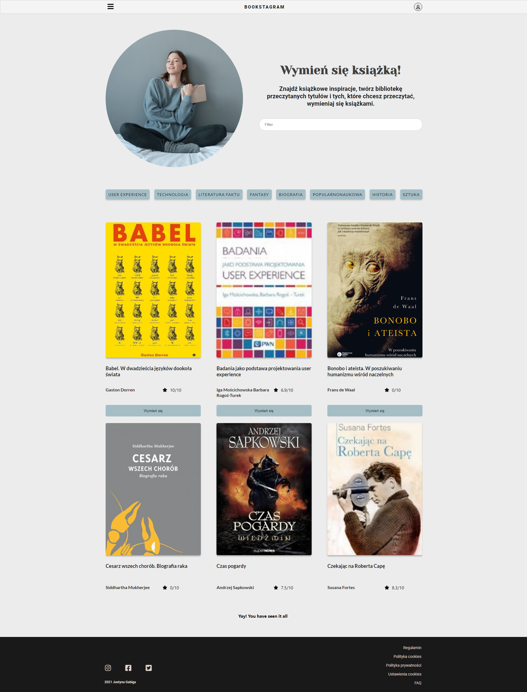
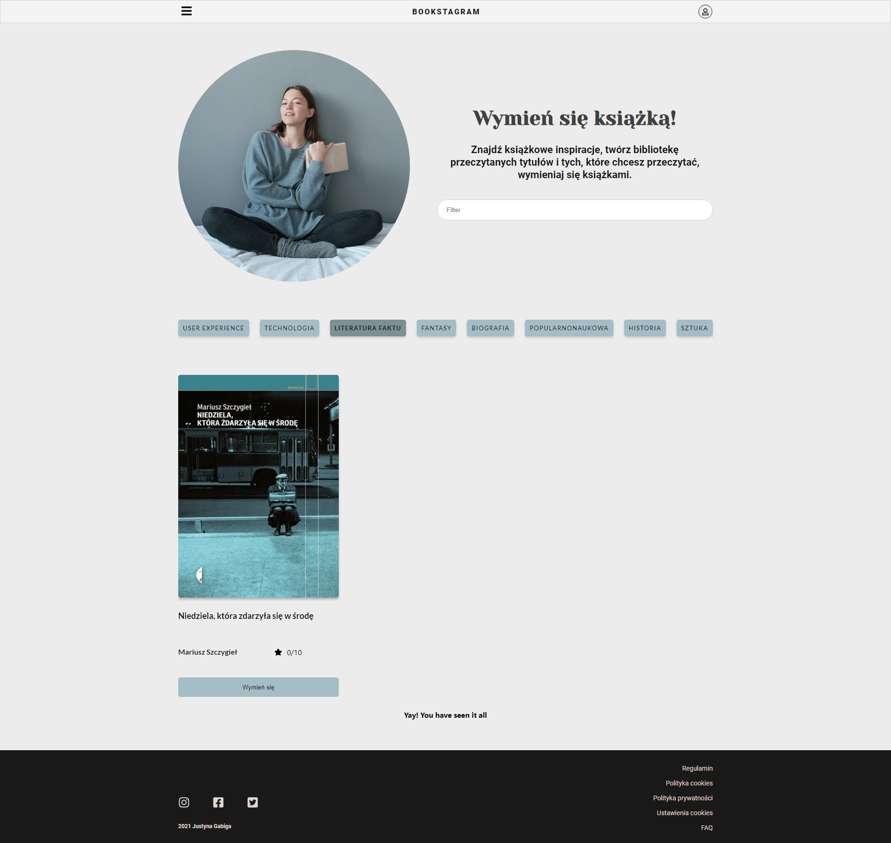
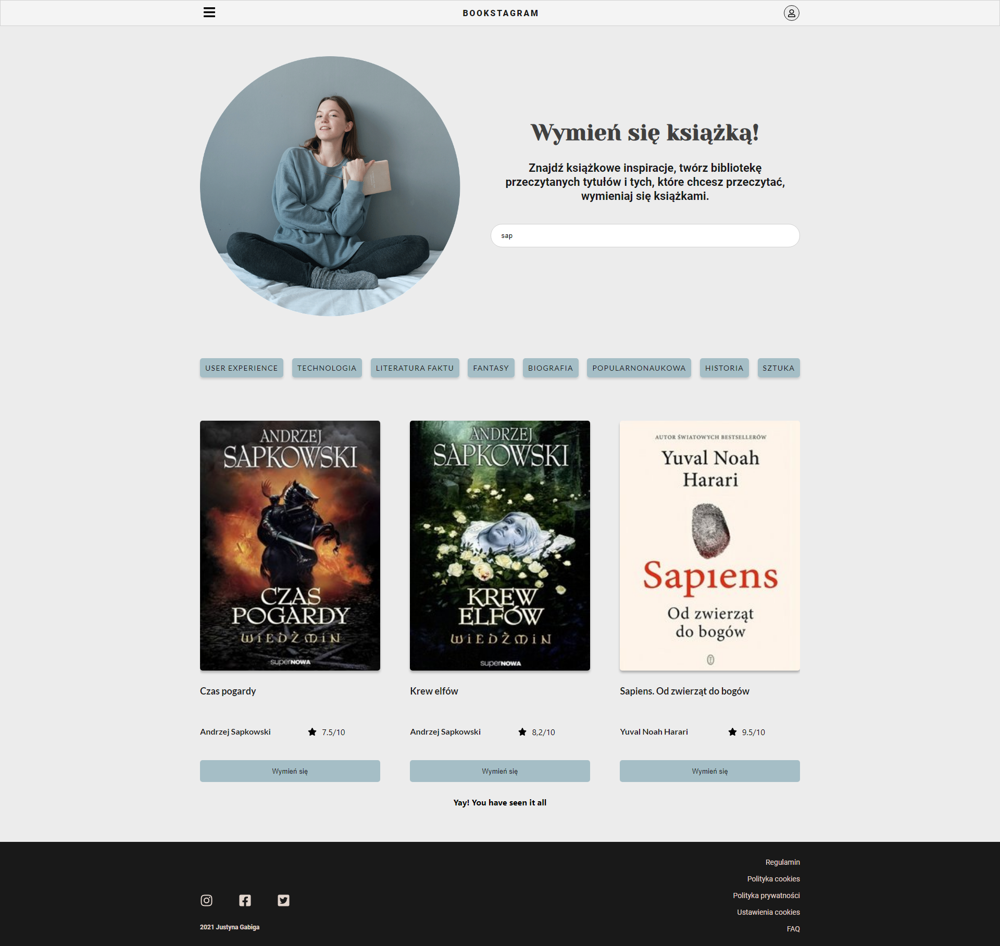
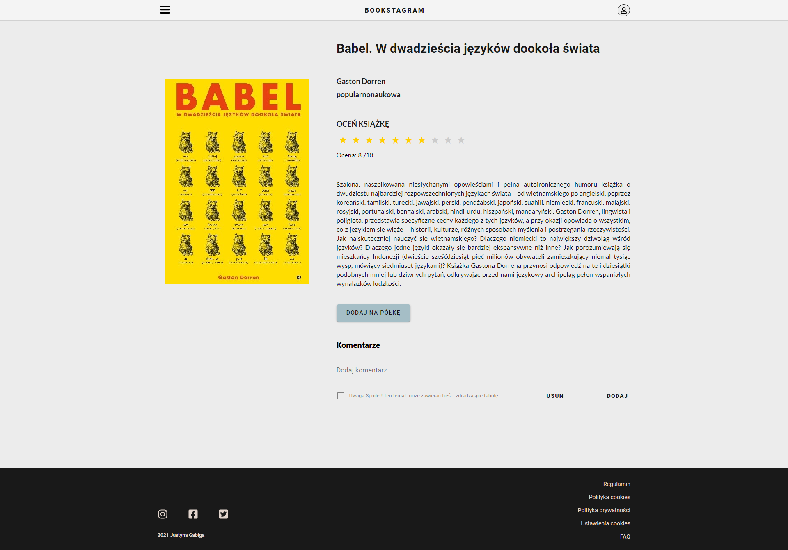
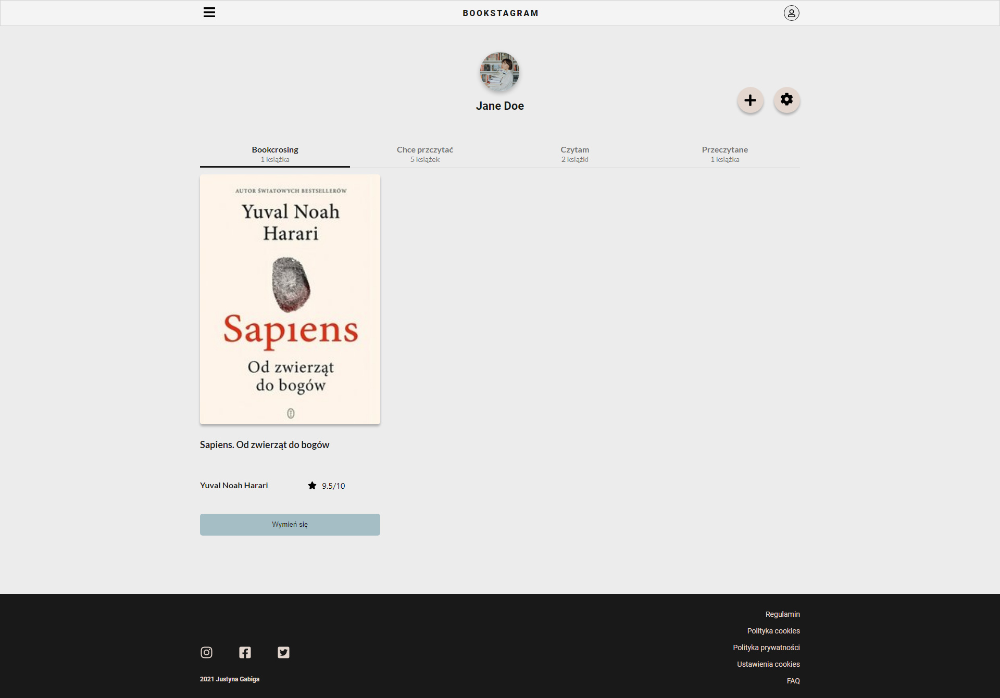

# Table of Contents

1. [General info](#installation)
2. [Technologies](#example2)
3. [Setup](#third-example)
4. [Features](#features)
5. [Project status](#projectstatus)
5. [Demo](#demo)
## General info

The main purpose of the application is to manage user's home library and exchange books with friends.  

App was created on educational purposes, mainly so that I could consolidate my knowledge of Back-end and Front-end technologies.

## Technologies
#### Front-end
App was created using React.js with functional components and has been deployed on Firebase. 

##### Used technologies:
- React  17.0.2
- Axios 
- Firebase 9.1.1
- Material UI
#### Back-end
Back-end project uses non relational database - Mongodb, and it's deployed on Heroku.
The connection to the database is made in the backend application written in node.js
which  allow to integrate with frontend by API.
##### Used technologies:
- Node.js
- Mongoose
- Mongodb
- Heroku


Link to [API repository.](https://github.com/JotGabiga/BookcrossingApp-api) 


## Setup
In the project directory, you can run:
```bash
npm run start
```
Runs the app in the development mode. 
Open http://localhost:3000 to view it in the browser.
The page will reload if you make edits. You will also see any lint errors in the console.           

```bash
npm run build
```
Builds the app for production to the build folder. It correctly bundles React in production mode and optimizes the build for the best performance. 

## Features
Bookcrossing App has for now three main functionalities: 
#### Home page
The home page displays all books. It has functionality of filtering by tags and dynamic search. Also API and React Infinite Scroll based pagination was used.
##### Homepage

##### Filtering

##### Search


#### Book page
Book page allows users to view books, read its description, add rate and post a comment. In the comment section there is opportunity to mark it as a spoiler. Comment mark as a spoiler could be read by click on the alert information.



#### User page
User page allows users to display books in their library, sorted by categories like read, want to read, currently reading and those to be replaced in bookcrossing initiative. 




<!-- The page is full Responsive. RWD was  introduced by adding CSS3 media queries, flexible images and elements sized in relative units. 

Before implementation UI was first design with Figma.  -->

<!--  -->

## Project status

I plan to further develop the project. I am going to add features like Bookcross functionality, Registration and
Login page.

## Demo
##### Here you can play with a demo of the front-end of [Bookcrossing app](https://bookcrossing-328121.web.app/).